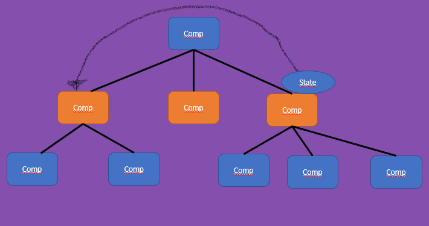
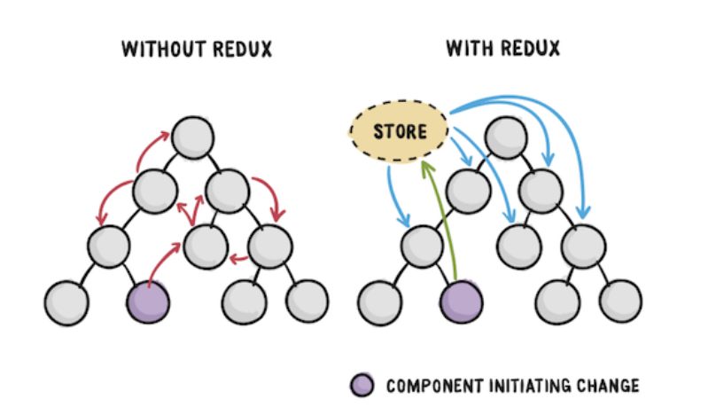

# Redux

# Entendo o Redux (Gerenciamento de Estados)

- Problema

Em determinado momento teremos um stato dentro de um componente que é preciso compartilhar com outro componente que está longe, em relação a arvore de componentes.

- Solução

Nessa situação termos um estado externalizado, o redux é uma solução de gerenciamento de estado das aplicações.
Desta forma, um componente pode mudar o estado e alguma outra componente sabera que o estado foi mudado.

# Nomeclatura 

- Action: é um objeto que tem au menos um atibuto, que se chama type ela também pode ter outros dados.
  
- Action Creator: é a logica, que é disparado por um evento. É uma função, que retorna uma Action e é sícrona.
  
- Reducers: a ideia é ter um reducers para cada atribudo do estado. E o papel dele é receber o estado anterior, receber a ação e com isso ele gera um novo atributo, que é uma nova versão do estado.
  São funções puras, cada uma altera um atributo, um evento dispara todos.

# Anatomia da Action

        {
            type: "ALUM_EVENTO_OCORREU",
            payload:{
                ... Aqui vai os dadoa ...
            }
        }

Expmplo de Action #1

        {
            type: "NUMERO_ALTERADO",
            payload: 12
        }

Expmplo de Action #2

        {
            type: "LISTA_PRODUTOS",
            payload:[
                {id:1, name: "Caneta", preco: 3.5},
                {id:2, name: "Lapis", preco: 4}
            ]
        }

# Anatomia da Action Creator

        function fazerAlgo(param){
            return{
                type:"ALGUM_EVENTO_OCORREU",
                payload:{...}
            }
        }

Expmplo de Action #1

         function fazerAlgo(param){
            return{
                type:"ALGUM_EVENTO_OCORREU",
                payload: axios.get("http://url")
            }
        }

# Anatomia do Estado

O estado é um objeto com chave e valor.

        {
            chave: valor
        }

# Como o Estado é Gerado?

São gerado apartir de funções, cada uma alterando o estado de um atributo.

        {
            chave: function(estadoAnderior, acao) {

                ... logica ...

                return proximoEstado
            }

        }

Exemplo:

        Estado 1
        {
            products:[{...}],
            auth:{...}
        }

        Action
        {
            type:'ADD_PROD',
            payload:{...}
        }

        export default function( state, action){
            switch(action.type){
                case "ADD_PROD":
                    return [
                        ...state,
                        action.payload
                    ]
                
                default:
                    retunrn satate
            }
        }

        Estado 2
        {
            products:[{...},{...}],
            auth:{...}
        }

# Criando um projeto 

        yarn create react-app <nome_do_projeto>